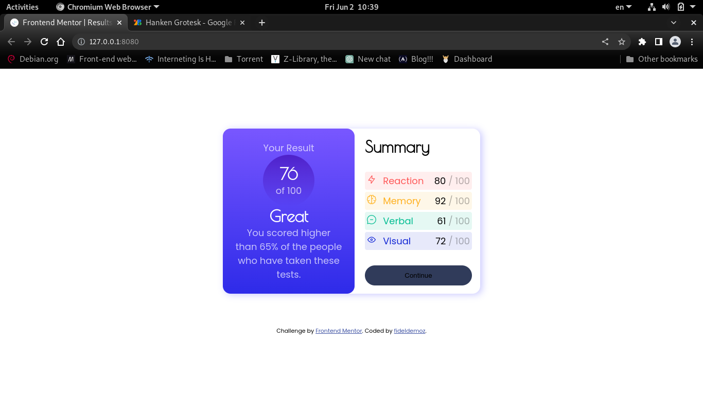

# Frontend Mentor - Results summary component solution

This is a solution to the [Results summary component challenge on Frontend Mentor](https://www.frontendmentor.io/challenges/results-summary-component-CE_K6s0maV). Frontend Mentor challenges help you improve your coding skills by building realistic projects. 

## Table of contents

- [Overview](#overview)
  - [The challenge](#the-challenge)
  - [Screenshot](#screenshot)
  - [Links](#links)
- [My process](#my-process)
  - [Built with](#built-with)
  - [What I learned](#what-i-learned)
  - [Continued development](#continued-development)
  - [Useful resources](#useful-resources)
- [Author](#author)

## Overview

### The challenge

Users should be able to:

- View the optimal layout for the interface depending on their device's screen size
- See hover and focus states for all interactive elements on the page

### Screenshot



### Links

- Solution URL: [Github repository](https://www.github.com/fideldemo/results-summary-fem)
- Live Site URL: [Github pages](https://fideldemoz.github.io/results-summary-fem)

## My process

### Built with

- Semantic HTML5 markup
- CSS custom properties
- Flexbox
- Mobile-first workflow
- CSS functions

### What I learned

I thought I had everything I needed to build this project, at first. But in the middle of the work I realised I need to learn some things:

#### Setting background to list items
I first tried setting `list-style-image` but that didn't work out because it was adding extra marging and I had cleared that margin out, so, it just wasnt showing the list icons.

Then I had to google (duckduckgo LOL) a little bit. That was when I learned this piece of code here:
```css
li{
	background-image: url(./image.jpg);
	background-repeat: no-repeat;
	background-position: .2rem .3em; /*it is very important to set the position of the icon.*/
	padding-left: 2.2rem; /*add padding on the left to show the icon clearly*/
}
```

### Continued development

This was my first challenge. Now that I now how useful it is to develop real world skills, I want to commit at least one challenge for week.

### Useful resources
- [Tutorial 1 - Background images for bullets - all steps combined](https://css.maxdesign.com.au/listutorial/master.htm) - This tutorial helped me solve the list icons. It is really clear and straight to the point.

### Constraints
I didn't find it helpfull the fact that they specified mobile width to 375px, because there are larger mobile devices and the project is just going to look bad on them. For this reason, I set mobile device width to 455px to behave well in all devices and have smooth transition form mobile view to desktop, when the screen is zoomed or resized.

## Author

- Website - [https://fideldemoz.github.io](https://fideldemoz.github.io)
- Frontend Mentor - [@fideldemoz](https://www.frontendmentor.io/profile/fideldemoz)
- Facebook - [@fidel.livino](https://www.facebook.com/fidel.livino)
